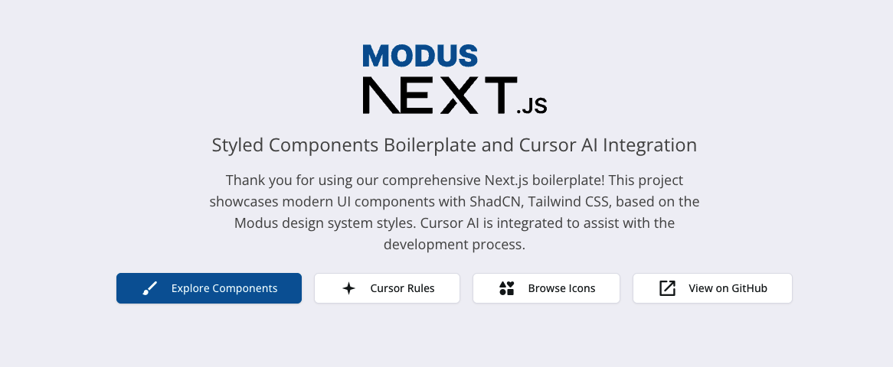

# Next.js 15 Modus - Styled Components Boilerplate

This is a comprehensive showcase and a boilerplate of UI components built with **Next.js 15**, **ShadCN**, and **Tailwind CSS**. The project serves as a visual library and a starting point for building modern, responsive, and themeable web applications.

## 🌐 Live Demo

**Experience the full component showcase live:** [https://master.d3i4kga674ysc3.amplifyapp.com/](https://master.d3i4kga674ysc3.amplifyapp.com/)



Explore all components, custom implementations, and theming capabilities in the interactive demo. The showcase includes over 40 UI components, 32 calendar variations, custom toolbars, and comprehensive documentation.

## ✨ Features

- **Next.js 15**: Built on the latest version of Next.js, utilizing the App Router.
- **ShadCN Components**: A wide variety of beautifully crafted and accessible UI components.
- **Tailwind v3 CSS**: A utility-first CSS framework for rapid UI development.
- **Theming**: Light and dark mode support out-of-the-box, easily customizable via CSS variables.
- **Responsive Design**: All components are designed to be fully responsive across different screen sizes.
- **Component Showcase**: A dedicated section (`/styled_components`) to view and interact with all available components.
- **32 Calendar Variations**: Includes an extensive collection of pre-designed calendar components for various use cases.
- **Custom Components**: Four fully-featured custom components built with Modus icons and advanced functionality.
- **Cursor AI Integration**: Comprehensive AI assistance with project-specific rules, memories, and intelligent code generation.
- **MCP Integration**: Model Context Protocol servers including Figma and Context7 for enhanced AI capabilities.
- **Modus Design System**: Strict enforcement of Modus design system standards with validated icon usage.
- **Automated Quality Assurance**: ESLint rules, pre-commit hooks, and automated validation to enforce CSS custom properties usage and prevent hardcoded colors.

## 🛠️ Tech Stack

- **Framework**: [Next.js](https://nextjs.org/)
- **Styling**: [Tailwind CSS v3](https://tailwindcss.com/)
- **UI Components**: [ShadCN/UI](https://ui.shadcn.com/)
- **Icons**: [Modus Icons](https://modus-icons.trimble.com/)
- **Theming**: [next-themes](https://github.com/pacocoursey/next-themes)
- **Charts**: [Recharts](https://recharts.org/)
- **Calendars**: [React Day Picker](http://react-day-picker.js.org/)
- **Toasts**: [Sonner](https://sonner.emilkowal.ski/)
- **Language**: [TypeScript](https://www.typescriptlang.org/)
- **Linting**: [ESLint](https://eslint.org/) with custom rules for color enforcement
- **Git Hooks**: [Husky](https://typicode.github.io/husky/) for pre-commit validation

## 🤖 Cursor AI Integration

This project includes comprehensive **Cursor AI configuration** for enhanced development experience:

### Project Rules (`@/.cursor/rules/`)

- **`code-rules.mdc`**: Enforces code quality standards, file size limits, and clean code practices
- **`modus-icons-usage.mdc`**: Ensures consistent Modus Icons implementation with accessibility guidelines
- **`modus-icon-names.mdc`**: Validates icon names against the complete list of available Modus icons
- **`new-components.mdc`**: Provides mandatory component templates and development standards
- **`nextjs15-framework.mdc`**: Guides proper usage of Next.js 15 and React 19 features

### MCP Integration (`@/.cursor/mcp.json`)

- **Figma MCP**: Direct design-to-code workflow with real-time Figma asset access
- **Context7 MCP**: Up-to-date documentation and version-specific code examples
- **Real-time Enhancement**: Live documentation lookup and design token generation

### Setup Documentation (`@/add_these_manually/`)

- **`cursor-memories-guide.md`**: Complete guide for creating and managing Cursor Memories
- **`user-rule.md`**: User-specific rules for individual Cursor settings

### Benefits

- **Intelligent Code Generation**: AI understands project patterns and generates compliant code
- **Consistent Standards**: Automatic enforcement of Modus design system and Next.js 15 best practices
- **Icon Validation**: Prevents invalid icon usage with real-time validation
- **Context Awareness**: AI remembers project decisions and preferences across sessions
- **Quality Assurance**: Built-in code quality checks and architectural guidance
- **MCP Server Integration**: Figma and Context7 MCP servers for design-to-code workflows and real-time documentation

## 🚀 Getting Started

Follow these instructions to get the project up and running on your local machine.

### Prerequisites

Make sure you have Node.js (version 18.x or higher) and npm installed.

- [Node.js](https://nodejs.org/)
- [npm](https://www.npmjs.com/)

### Installation

1.  Clone the repository:

    ```bash
    git clone https://github.com/your-username/nextjs15-modus-styled.git
    cd nextjs15-modus-styled
    ```

2.  Install the dependencies:

    ```bash
    npm install
    ```

    **Note**: The `npm install` command automatically sets up Husky git hooks via the `"prepare"` script, enabling pre-commit validation for all contributors.

### Running the Application

To build and run the application locally, use the following commands:

```bash
npm run build
npm run start
```

The application will be available at `http://localhost:3000`.

## 🔍 Quality Assurance & Linting

This project enforces strict code quality standards through automated linting and validation systems that prevent hardcoded colors and ensure compliance with the Modus design system.

### Automated Enforcement

#### ESLint Rules (`eslint.config.mjs`)

Custom ESLint rules prevent hardcoded Tailwind colors at development time:

- **Text Colors**: Catches `text-blue-500`, `text-red-600`, etc.
- **Background Colors**: Catches `bg-blue-500`, `bg-green-400`, etc.
- **Border Colors**: Catches `border-blue-500`, `border-l-red-500`, etc.
- **Comprehensive Coverage**: Includes directional borders (`border-l-`, `border-r-`, `border-t-`, `border-b-`)

#### Pre-commit Hooks (`.husky/pre-commit`)

Git hooks prevent committing code with hardcoded colors:

```bash
# Automatically runs before each commit
npm run validate:styles
```

#### VS Code Integration (`.vscode/settings.json`)

IDE-level validation with real-time feedback:

- ESLint integration with immediate error highlighting
- Tailwind CSS IntelliSense with validation
- Automatic formatting and error detection

### Available Commands

```bash
# Full style validation (ESLint + color check)
npm run validate:styles

# Check for hardcoded colors only
npm run lint:colors

# Standard ESLint check
npm run lint

# Development with strict validation
npm run dev:strict
```

### Enforcement Rules

#### ✅ Required CSS Patterns

```tsx
// Use CSS custom properties from globals.css
className="bg-card text-card-foreground border-border"
className="text-primary bg-primary"
style={{ padding: 'var(--spacing)', borderRadius: 'var(--radius)' }}
```

#### ❌ Forbidden Patterns

```tsx
// Hardcoded Tailwind colors (will be caught by ESLint)
className="bg-blue-500 text-white border-red-300"
className="text-gray-900 bg-slate-100"

// Hardcoded CSS values (will be caught by linting)
style={{ padding: '16px', color: '#333333' }}
```

### Benefits

- **Automatic Prevention**: Impossible to commit hardcoded colors
- **Real-time Feedback**: Immediate warnings during development
- **Consistent Theming**: All colors automatically support dark/light mode
- **Design System Compliance**: Enforced adherence to Modus design standards
- **Team Consistency**: Standardized approach across all developers
- **Zero Configuration**: Works automatically for clones and forks

### Clone/Fork Compatibility

When someone clones or forks this repository:

1. **`git clone <repo>`** - Repository includes all configuration files
2. **`npm install`** - Automatically runs `"prepare": "husky"` script
3. **Git hooks activate** - Pre-commit validation starts working immediately
4. **No manual setup required** - Everything works out of the box

**Files that ensure automatic setup:**

- `.husky/pre-commit` - Pre-commit hook configuration (committed to repo)
- `"prepare": "husky"` in `package.json` - Auto-installs hooks on npm install
- `eslint.config.mjs` - ESLint rules for color validation
- Custom npm scripts - Validation commands available immediately

## 📁 Project Structure

The project follows a standard Next.js App Router structure with some added conventions for organizing components and styles, plus comprehensive Cursor AI integration for enhanced development experience.

- `@/.cursor`: **Cursor AI Configuration** - Contains project rules for AI assistance and MCP server configurations
  - `rules/`: MDC rule files that guide Cursor's AI behavior and code generation
  - `mcp.json`: Model Context Protocol server configurations for Figma and Context7 integration
- `@/add_these_manually`: **Setup Documentation** - Manual setup guides and references
  - `cursor-memories-guide.md`: Comprehensive guide for using Cursor Memories
  - `user-rule.md`: User-specific Cursor rules and preferences
- `@/app`: **Next.js App Router** - Contains all the routes, layouts, and pages for the application
  - `styled_components/`: The main showcase area with dynamic routes for each component
- `@/components`: **Reusable React Components** - Houses all UI components and custom implementations
  - `ui/`: Core ShadCN UI components
  - `calendars/`: The 32 calendar components with various features
  - `header/`: Custom app header component with mobile responsiveness
  - `toolbars/`: Custom toolbar components including the floating toolbar
  - `panes/`: Custom side pane components for secondary content
  - `treeview/`: Custom tree view components for hierarchical data
- `@/hooks`: **Custom React Hooks** - Shared stateful logic and utilities
- `@/lib`: **Utility Functions** - Helper functions and shared utilities
- `@/public`: **Static Assets** - Images, icons, and other public resources

## 🧩 Custom Components

In addition to the standard ShadCN components, this project includes four custom-built components that extend functionality:

### App Header

A comprehensive application header component with mobile responsiveness and optional elements:

- **Configurable Elements**: Menu button, logo placeholder, search button, help button, app launcher, avatar, and mode toggle
- **Project Dropdown**: Optional centered dropdown for project selection
- **Mobile Responsive**: Adaptive layout with overflow menu for mobile devices
- **Modus Icons**: Fully integrated with the Modus icon system
- **Accessibility**: Full keyboard navigation and screen reader support

### Floating Toolbar

A versatile floating toolbar component with advanced features:

- **Multiple Item Types**: Supports buttons, toggles, dropdowns, and select inputs
- **Flexible Positioning**: Top, bottom, custom, or contained positioning with precise control
- **Orientation Support**: Horizontal and vertical layouts
- **Interactive Features**: Tooltips, keyboard shortcuts, active states, and action callbacks
- **Responsive Design**: Adapts to different screen sizes with overflow handling

### Side Pane

A flexible side panel component for secondary content and navigation:

- **Multiple Positions**: Left, right, top, or bottom positioning
- **Resizable**: Optional resize functionality with drag handles
- **Collapsible**: Expandable and collapsible states with smooth animations
- **Overlay Support**: Modal-style overlay for mobile experiences
- **Content Areas**: Header, content, and footer sections with customizable layouts

### Tree View

A hierarchical tree view component for file systems and navigation:

- **Drag & Drop**: Built-in drag and drop functionality for reorganizing items
- **Custom Icons**: Support for different icons per node state (open, closed, selected)
- **Interactive Actions**: Action buttons that appear on hover or selection
- **Expandable Nodes**: Collapsible tree structure with nested children
- **Selection States**: Single and multi-select capabilities with callbacks

## 🎨 Theming

Theming is handled using CSS variables defined in `@/app/globals.css`, with custom styles to mimic the Modus brand. You can customize the color palette for both light and dark themes by modifying the variables in the `:root` and `.dark` selectors. The `next-themes` library is used to toggle between themes.

## 📦 Components Showcased

This project includes a wide range of components, each with its own showcase page. Here are some of the categories available:

- **Layout**: Accordion, Card, Carousel, Resizable, Separator, Tabs
- **Forms**: Button, Checkbox, Input, Form, Radio Group, Select, Slider, Switch, Textarea
- **Feedback**: Alert, Progress, Skeleton, Sonner (Toasts)
- **Overlays**: Alert Dialog, Dialog, Drawer, Hover Card, Popover, Sheet, Tooltip
- **Navigation**: Breadcrumb, Dropdown Menu, Menubar, Navigation Menu, Pagination, Sidebar
- **Data Display**: Aspect Ratio, Avatar, Badge, Calendar (32 variants), Chart, Table
- **Custom Components**: App Header, Floating Toolbar, Side Pane, Tree View
- **MCP Integration**: Figma and Context7 MCP servers for enhanced AI development workflows
- **Icons**: A dedicated page to browse and search all Modus Icons.

To see them all in action, navigate to `/styled_components`. The icon showcase is at `/styled_components/modus-icons` and MCP integration details are at `/styled_components/mcp`.

## 📄 License

This project is licensed under the MIT License. See the `LICENSE` file for more details.

# Detailed Project Structure

Here is a tree view of the project structure:

```
.
├── .husky/                                     # Git Hooks Configuration
│   └── pre-commit                              # Pre-commit validation script
├── .vscode/                                    # VS Code Configuration
│   └── settings.json                           # IDE settings for ESLint and Tailwind validation
├── .cursor/                                    # Cursor AI Configuration
│   ├── mcp.json                                # Model Context Protocol server configurations
│   └── rules/                                  # Project rules for AI assistance
│       ├── code-rules.mdc                      # Code quality standards and best practices
│       ├── modus-icon-names.mdc                # Complete list of valid Modus icon names
│       ├── modus-icons-usage.mdc               # Modus Icons implementation patterns
│       ├── new-components.mdc                  # Component development standards
│       └── nextjs15-framework.mdc              # Next.js 15 and React 19 framework patterns
├── add_these_manually/                         # Setup Documentation
│   ├── cursor-memories-guide.md                # Comprehensive guide for using Cursor Memories
│   └── user-rule.md                            # User-specific Cursor rules and preferences
├── app/                                        # Next.js App Router
│   ├── favicon.ico                             # Application favicon
│   ├── globals.css                             # Global styles and CSS custom properties
│   ├── layout.tsx                              # Root layout with theme provider
│   ├── page.tsx                                # Home page component
│   └── styled_components/                      # Component showcase section
│       ├── [slug]/                             # Dynamic component showcase routes
│       │   └── page.tsx                        # Dynamic page for individual components
│       ├── components/                         # Individual component showcase files
│       │   ├── accordion-showcase.tsx          # Accordion component demonstration
│       │   ├── alert-dialog-showcase.tsx       # Alert dialog component demonstration
│       │   ├── alert-showcase.tsx              # Alert component demonstration
│       │   ├── ... (and many other component showcases)
│       │   └── tooltip-showcase.tsx            # Tooltip component demonstration
│       ├── floating-toolbar/                   # Custom floating toolbar showcase
│       │   ├── floating-toolbar-demo.tsx       # Floating toolbar component demo
│       │   └── page.tsx                        # Floating toolbar showcase page
│       ├── header/                             # Custom app header showcase
│       │   ├── app-header-demo.tsx             # App header component demo
│       │   └── page.tsx                        # App header showcase page
│       ├── side-pane/                          # Custom side pane showcase
│       │   ├── side-pane-demo.tsx              # Side pane component demo
│       │   └── page.tsx                        # Side pane showcase page
│       ├── treeview/                           # Custom tree view showcase
│       │   ├── tree-view-demo.tsx              # Tree view component demo
│       │   └── page.tsx                        # Tree view showcase page
│       ├── layout.tsx                          # Layout for component showcase pages
│       ├── mcp/                                # Model Context Protocol showcase
│       │   └── page.tsx                        # MCP servers documentation and configuration
│       ├── modus-icons/                        # Modus Icons showcase
│       │   └── page.tsx                        # Icons browser and search page
│       └── page.tsx                            # Component showcase landing page
├── components/                                 # Reusable React Components
│   ├── calendars/                              # Calendar component collection
│   │   ├── calendar-01.tsx                     # Calendar variant 1
│   │   ├── ... (32 calendar components)        # Additional calendar variants
│   │   └── calendar-32.tsx                     # Calendar variant 32
│   ├── header/                                 # Custom app header components
│   │   ├── app-header.tsx                      # Main app header component
│   │   └── index.ts                            # Header components export file
│   ├── panes/                                  # Custom side pane components
│   │   ├── side-pane.tsx                       # Main side pane component
│   │   └── index.ts                            # Pane components export file
│   ├── toolbars/                               # Custom toolbar components
│   │   ├── floating-toolbar.tsx                # Main floating toolbar component
│   │   └── index.ts                            # Toolbar components export file
│   ├── treeview/                               # Custom tree view components
│   │   ├── tree-view.tsx                       # Main tree view component
│   │   └── index.ts                            # Tree view components export file
│   ├── ui/                                     # Core ShadCN UI components
│   │   ├── accordion.tsx                       # Accordion UI component
│   │   ├── alert-dialog.tsx                    # Alert dialog UI component
│   │   ├── alert.tsx                           # Alert UI component
│   │   ├── ... (many shadcn ui components)     # Additional ShadCN components
│   │   └── tooltip.tsx                         # Tooltip UI component
│   ├── copy-button.tsx                         # Copy to clipboard button component
│   ├── mode-toggle.tsx                         # Theme mode toggle component
│   └── theme-provider.tsx                      # Theme context provider component
├── hooks/                                      # Custom React Hooks
│   ├── use-mobile.ts                           # Mobile device detection hook
│   └── use-mobile.tsx                          # Alternative mobile hook implementation
├── lib/                                        # Utility Functions
│   └── utils.ts                                # Shared utility functions (cn, etc.)
├── public/                                     # Static Assets
│   ├── file.svg                                # File icon asset
│   ├── globe.svg                               # Globe icon asset
│   ├── next.svg                                # Next.js logo asset
│   ├── next2.svg                               # Alternative Next.js logo
│   ├── product_logos/                          # Product logo assets
│   │   ├── Connect-Horizontal-RGB.svg          # Connect product logo
│   │   ├── Logo-Accubid-Anywhere-RGB-Full-Horizontal.svg # AccuBid logo
│   │   ├── ... (multiple product logos)        # Additional product logos
│   │   └── Trimble_logo_light.svg              # Trimble company logo
│   ├── vercel.svg                              # Vercel logo asset
│   └── window.svg                              # Window icon asset
├── eslint.config.mjs                            # ESLint configuration with custom color validation rules
├── components.json                             # ShadCN components configuration
├── next.config.ts                              # Next.js configuration
├── package.json                                # Project dependencies and scripts
├── postcss.config.js                           # PostCSS configuration
├── project-structure.md                        # Detailed project structure documentation
├── README.md                                   # Project documentation
├── tailwind.config.js                          # Tailwind CSS configuration
└── tsconfig.json                               # TypeScript configuration
```

## Folder Descriptions

### `@/.husky`

This directory contains **Git hooks configuration** using Husky for automated quality assurance and pre-commit validation.

- **`pre-commit`**: Automatically runs style validation before each commit to prevent hardcoded colors and ensure code quality compliance. Executes `npm run validate:styles` to catch ESLint violations and color validation issues.

### `@/.vscode`

This directory contains **VS Code workspace configuration** for consistent development environment and real-time validation.

- **`settings.json`**: IDE-specific settings that enable ESLint integration, Tailwind CSS validation, and automatic error detection. Provides immediate feedback for hardcoded colors and CSS violations during development.

### `@/.cursor`

This directory contains **Cursor AI configuration** that enhances the development experience with intelligent code assistance and MCP server integration.

- **`mcp.json`**: Model Context Protocol server configurations for extending AI capabilities:
  - **Figma MCP**: Local server connection for design-to-code workflows and asset extraction
  - **Context7 MCP**: Remote NPM package providing up-to-date documentation and code examples
- **`rules/`**: Contains MDC (Markdown Document with Context) rule files that guide Cursor's AI behavior:
  - **`code-rules.mdc`**: Code quality standards, naming conventions, and best practices for the project
  - **`modus-icon-names.mdc`**: Complete list of valid Modus icon names for validation and reference
  - **`modus-icons-usage.mdc`**: Implementation patterns and guidelines for using Modus Icons consistently
  - **`new-components.mdc`**: Component development standards and mandatory templates for Next.js 15 + React 19
  - **`nextjs15-framework.mdc`**: Framework-specific patterns for App Router, Server Components, and React 19 features

### `@/add_these_manually`

This directory contains **setup documentation** and guides that should be manually reviewed and applied by developers.

- **`cursor-memories-guide.md`**: Comprehensive guide explaining how to create and manage Cursor Memories for project-specific AI assistance
- **`user-rule.md`**: User-specific Cursor rules and preferences that can be added to individual Cursor settings

### `@/app`

This directory is the heart of the Next.js application, following the App Router paradigm. It's responsible for routing and defining the structure of different pages and layouts.

- **`globals.css`**: Contains the global styles for the application, including CSS variables for theming.
- **`layout.tsx`**: The root layout that wraps all pages. It sets up the HTML structure, includes the global font, and wraps the application with the `ThemeProvider`.
- **`page.tsx`**: The main entry point or home page of the application.
- **`styled_components/`**: A dedicated section for showcasing the various UI components available in the project.
  - **`[slug]/page.tsx`**: A dynamic page that renders a specific component showcase based on the URL slug. It dynamically imports and displays the component.
  - **`components/`**: Contains the individual showcase components for each UI element (e.g., `accordion-showcase.tsx`, `button-showcase.tsx`).
  - **`header/`**: Showcase for the custom App Header component.
  - **`floating-toolbar/`**: Showcase for the custom Floating Toolbar component.
  - **`side-pane/`**: Showcase for the custom Side Pane component.
  - **`treeview/`**: Showcase for the custom Tree View component.
  - **`layout.tsx`**: Provides a layout for the component showcase pages, including a sidebar for navigation.
  - **`page.tsx`**: The landing page for the `/styled_components` route.
  - **`mcp/`**: A dedicated section for showcasing Model Context Protocol server integration.
    - **`page.tsx`**: Documentation and configuration details for Figma and Context7 MCP servers.
  - **`modus-icons/`**: A dedicated section for showcasing the various Modus icons available in the project.
    - **`page.tsx`**: The landing page for the `/modus-icons` route.

### `@/components`

This directory houses all the reusable React components of the application, organized for clarity and maintainability.

- **`ui/`**: This sub-directory contains the core ShadCN UI components. These are low-level building blocks like `Button`, `Card`, `Input`, `Dialog`, etc. They are styled and ready to be used across the application.
- **`calendars/`**: A collection of 32 different pre-built calendar components with various features and configurations.
- **`header/`**: Custom app header component with mobile responsiveness and configurable elements.
- **`toolbars/`**: Custom toolbar components including the floating toolbar with advanced positioning and interaction features.
- **`panes/`**: Custom side pane components for secondary content and navigation.
- **`treeview/`**: Custom tree view components for hierarchical data display and interaction.
- **`copy-button.tsx`**: A simple component for a button that copies given text to the clipboard.
- **`mode-toggle.tsx`**: A component that allows the user to switch between light, dark, and system themes.
- **`theme-provider.tsx`**: A wrapper component that provides theme management capabilities to the entire application using `next-themes`.

### `@/hooks`

This directory contains custom React hooks that encapsulate and reuse stateful logic.

- **`use-mobile.ts`**: A custom hook to detect if the application is being viewed on a mobile device by checking for a media query match.

### `@/lib`

This directory is for utility functions, helpers, and other library-like code that can be used throughout the application.

- **`utils.ts`**: Contains helper functions. Currently, it includes the `cn` function from `tailwind-merge` and `clsx` for conditionally combining CSS classes.

### `@/public`

This directory stores static assets that are served directly from the root of the application.

- This includes images (`.svg`, `.ico`), and other static files that need to be publicly accessible.
